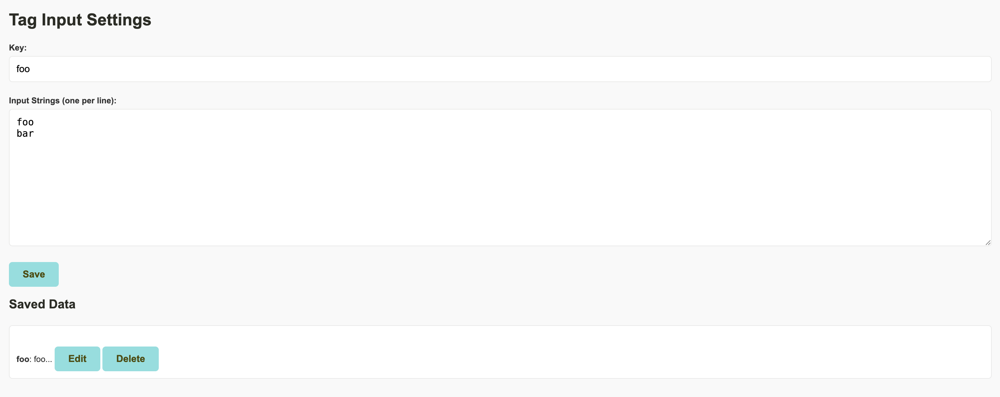

# patretag (Patreon Tag Helper)

A Chrome extension to simplify tag management on Patreon creator pages.

## Features

* Adds a custom tag input interface to Patreon creator pages
* Allows quick addition of multiple tags from predefined sets
* Automatically adapts to Patreon's light and dark themes

## Installation

I will post the link when it is available on the Chrome Web Store.

## Usage

1. Navigate to your Patreon creator page
2. Look for the new tag input interface below the original tag input field
3. Select a predefined tag set from the dropdown menu
4. Click "Add Tags" to instantly add the selected tags to your Patreon post

## Configuration

To add or modify tag sets:

1. Click on the extension icon in Chrome
2. Use the provided interface to manage your tag sets

## Development
This extension is built using TypeScript. To set up the development environment:

1. Install dependencies: `npm install`
2. Compile TypeScript: `npm run build`

## License

MIT